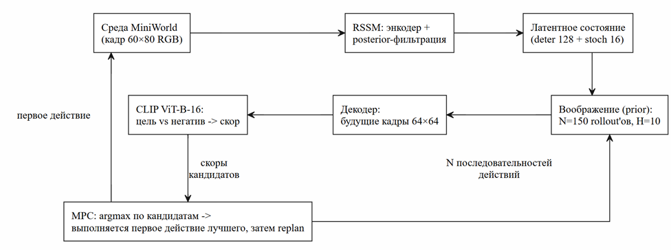

# World Model + VLM-скорер: управление агентом по текстовой цели

Демо-проект: агент в 3D-среде MiniWorld учится достигать цели, заданно текстом, без использования наград среды при планировании. Модель мира в стиле RSSM (PlaNet/Dreamer) воображает последствия действий, предобученный CLIP превращает воображаемые кадры в оценку достижения цели, а MPC-планировщик выбирает действия по этим оценкам.

Текстовая цель: `"a large red box close up"` - дойти вплотную к красному ящику.

## Схема пайплайна



## Результаты

Протокол: 3 сида × 15 эпизодов, лимит 15 шагов на эпизод, среда `MiniWorld-OneRoomS6Fast-v0`.

| Метод | Success rate | std по сидам |
|---|---|---|
| random | 0.42 | 0.03 |
| world-model planning (без VLM, reward-голова) | **0.71** | 0.03 |
| world-model planning + VLM (CLIP) | 0.58 | 0.11 |

Оба планировщика уверенно превосходят случайную политику - модель мира и MPC работают. VLM-планировщик достигает 0.58, **не используя ни одной награды среды** (цель задана только текстом), но уступает reward-голове, которой в этой среде «повезло»: случайная политика часто доходит до цели, давая ей плотный обучающий сигнал.

### Ablation: горизонт планирования

| Метод | H=10 | H=5 |
|---|---|---|
| planning (без VLM) | 0.711 ± 0.031 | 0.667 ± 0.054 |
| planning + VLM | 0.578 ± 0.113 | 0.578 ± 0.191 |

Reward-планировщику длинный горизонт нужен (разреженная награда «загорается» в воображении, только если кандидат дотянулся до цели). VLM-планировщик от горизонта не зависит: его ограничивает **качество декодированных кадров** - в воображении ящик «расплывается» уже через ~3 шага (см. `results/plots/imagination.png`), и CLIP не может оценить то, что декодер не нарисовал.

GIF-примеры эпизодов — в `results/gifs/`, графики — в `results/plots/`.

## Структура репозитория

```
├── notebooks/
│   └── world_model.ipynb      # Colab: полный прогон (сбор → обучение → оценка → артефакты)
├── src/
│   ├── config.py              # все гиперпараметры
│   ├── environment.py         # MiniWorld + препроцессинг кадров
│   ├── replay_buffer.py       # буфер и сбор случайных траекторий
│   ├── rssm.py                # модель мира: Encoder / RSSMCore / Decoder / RewardHead
│   ├── world_model.py         # лосс (recon + KL + reward), обучение, воображение
│   ├── clip_scorer.py         # VLM-скорер: CLIP, контрастный softmax по промптам
│   ├── planner.py             # MPC random shooting + objectives + Agent
│   ├── evaluate.py            # три метода, таблица, GIF, графики
│   └── utils.py               # сиды, чекпоинты
├── diagnose_clip.py           # диагностика CLIP-сигнала (история MiniGrid, см. отчёт)
├── diagnose_miniworld.py      # диагностика CLIP-сигнала в MiniWorld (гейт перед оценкой)
├── results/                   # таблицы, графики, GIF финального прогона
└── requirements.txt
```

## Установка

```bash
python -m venv .venv
# Windows: .\.venv\Scripts\Activate.ps1   |   Linux/macOS: source .venv/bin/activate
python -m pip install -r requirements.txt
```

Python 3.10+. Для обучения нужен GPU (Colab T4 достаточно); локально без GPU удобно запускать диагностики и оценку.

## Запуск

**Полный прогон (рекомендуется, Colab):** открыть `notebooks/world_model.ipynb` в Google Colab, включить GPU. Сбор 300 эпизодов → обучение RSSM → проверка реконструкций → таблица трёх методов → GIF → графики → архив артефактов. Headless-рендер MiniWorld поднимается внутри ноутбука.

## Как это работает

**Модель мира (RSSM).** Состояние = детерминированная «память» и стохастическая часть. Два режима шага: *prior* - предсказание без наблюдения (воображение), *posterior* - коррекция по реальному кадру (обучение и слежение). Лосс: реконструкция кадра и KL(posterior‖prior) и предсказание награды.

**VLM-скорер.** CLIP ViT-B-16 (веса OpenAI, вариант quickgelu). Скор кадра = softmax по косинусным близостям к двум промптам - цели (`a large red box close up`) и негативу (`a small red box far away`) → вероятность в [0,1]. По горизонту берётся максимум по последним K=3 декодированным кадрам rollout-а.

**Планировщик.** На каждом шаге среды: 150 случайных последовательностей длины 10 → параллельный прогон в воображении → оценка objective (CLIP или reward-голова) → выполняется первое действие лучшей последовательности → replan.

## Главные находки (подробно — в отчёте)

- **Отрицательный результат на MiniGrid:** в топ-даун рендере грид-мира визуального признака близости к цели физически нет (доля пикселей цели постоянна не смотря, какая дистанция), поэтому никакая VLM не может оценивать прогресс - ни текстовый, ни image-goal скоринг. Это свойство среды, а не модели; проект переехал в MiniWorld, где цель растёт в кадре при приближении.
- **Пойманный баг нормализации** (`/255` в препроцессинге) давал ложноположительный CLIP-сигнал на сломанных входах - отловлен диагностикой до обучения.
- **Точность воображения:** декодер уверенно рисует ящик лишь на ~3 шага вперёд, дальше CLIP-у нечего оценивать (подтверждено ablation по горизонту).

## Ссылки

- Hafner et al., *Learning Latent Dynamics for Planning from Pixels* (PlaNet), ICML 2019
- Hafner et al., *Dream to Control: Learning Behaviors by Latent Imagination* (Dreamer), ICLR 2020
- Radford et al., *Learning Transferable Visual Models From Natural Language Supervision* (CLIP), ICML 2021
- Chevalier-Boisvert et al., *Minigrid & Miniworld: Modular & Customizable RL Environments*, 2023